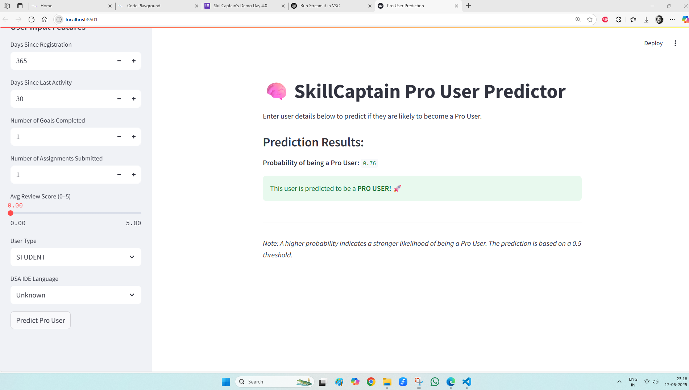

## Pro User Prediction on Skill_Captain website using Neural Network

This project predicts whether a user on skillcaptain website (https://skillcaptain.app/fe/home) is a PRO user or not, using a pre-trained neural network model based on input features.

## 🔧 Project Structure

- `pro_user_prediction_skill_captain.py`: Main script for Streamlit web app.
- `Pro_User_Prediction_skill_captain.ipynb`: Jupyter notebook with training and analysis.
- `pro_user_nn_model.h5`: Saved Keras model.
- `feature_scaler.pkl`: Saved Scikit-learn scaler.
- `predict_pro.py`: Helper script for prediction logic.

## 📦 Dependencies

Install the required packages:

```bash
pip install -r requirements.txt
````

## 🚀 How to Run

1. Create and activate a virtual environment:

```bash
python -m venv tfenv
tfenv\Scripts\activate
```

2. Install dependencies:

```bash
pip install -r requirements.txt
```

3. Run the Streamlit app:

```bash
streamlit run pro_user_prediction_skill_captain.py
```

## 📈 Output

* Takes input from users.
* Scales input using `feature_scaler.pkl`.
* Predicts skill level using the trained neural network model.

## 🧠 Model Info

* Built with TensorFlow and Keras.
* Uses Scikit-learn for preprocessing.




---

Feel free to clone, fork, or suggest improvements!

```


